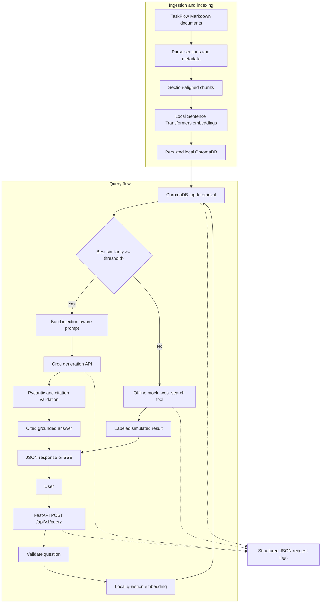

# TaskFlow Knowledge Base RAG API

## Overview

This repository contains a locally run retrieval-augmented generation (RAG) API over seven original, fictional TaskFlow API documents. It retrieves relevant sections, asks a Groq-hosted model to answer from that evidence, and returns document and section citations. If the best retrieval score is below the configured threshold, it calls a deterministic, offline mock search tool and labels its result as simulated rather than verified evidence.

The local vector index contains 28 section-aligned chunks. Embeddings run locally; generation uses the Groq API, so a Groq API key and network connection are needed for grounded answers.

## Architecture

The ingestion command parses Markdown at `##` headings, embeds each section with Sentence Transformers, and persists vectors and source metadata in ChromaDB. The query API validates the question, embeds it with the same local model, and retrieves the most similar sections. The orchestrator compares the best score to the configured threshold: supported questions go to Groq for a cited JSON answer, while weak matches call the offline mock fallback. The API validates model output with Pydantic before returning it and emits JSON logs with request timings and available token usage.



## Setup

Requirements: Python 3.11 or newer and a Groq account/API key. The Groq OpenAI-compatible endpoint is used through the OpenAI Python SDK; an OpenAI API key is not needed. Groq documents a Free tier and says a payment method is required to upgrade to its Developer tier ([Groq billing FAQ](https://console.groq.com/docs/billing-faqs)). Create/manage the API key in the [Groq Console](https://console.groq.com/keys).

```bash
git clone <repository-url>
cd rag-agent-api
python -m venv .venv
```

Activate the virtual environment, then install dependencies and configure the environment:

```bash
# macOS/Linux
source .venv/bin/activate

# Windows PowerShell alternative
# .\.venv\Scripts\Activate.ps1

python -m pip install -r requirements.txt
cp .env.example .env
```

Edit `.env` and set `GROQ_API_KEY`. To reproduce the evaluation configuration, set:

```dotenv
GENERATION_MODEL=openai/gpt-oss-120b
SIMILARITY_THRESHOLD=0.4
```

The checked-in `.env.example` currently defaults to `llama-3.3-70b-versatile` and threshold `0.75`; override those values as above for the reported evaluation. The local embedding model `sentence-transformers/all-MiniLM-L6-v2` is downloaded from Hugging Face when first needed. The `.env` file is ignored by Git.

Groq documents use of its API with OpenAI client libraries by configuring the Groq base URL and API key ([OpenAI compatibility guide](https://console.groq.com/docs/openai)).

## Running

Build or refresh the persisted local vector index:

```bash
python -m app.ingestion.build_index
```

Start the API:

```bash
python -m uvicorn app.api.main:app --reload
```

The health endpoint checks that the ChromaDB collection can be read:

```bash
curl http://127.0.0.1:8000/health
```

Observed during this session: `{"status":"ok","collection":"taskflow_knowledge","count":28}`.

## Usage

### Non-streaming request

```bash
curl -X POST http://127.0.0.1:8000/api/v1/query \
  -H "Content-Type: application/json" \
  -d '{"question":"How do I rotate an API token?"}'
```

Observed response from the live API:

```json
{
  "answer": "To rotate an API token, go to the console and use the token rotation feature. The new token is shown only once. Both old and new tokens remain valid for a ten-minute overlap period; after updating your integrations, revoke the old token. Store the new token in a secret manager and never keep it in source control.",
  "citations": [
    {
      "document": "authentication.md",
      "section": "Token rotation"
    }
  ],
  "confidence": 0.6482181549072266,
  "threshold_used": 0.4,
  "warnings": []
}
```

### Streaming request

Set `stream` to `true` to receive Server-Sent Events (SSE):

```bash
curl -N -X POST http://127.0.0.1:8000/api/v1/query \
  -H "Content-Type: application/json" \
  -d '{"question":"How do I rotate an API token?","stream":true}'
```

Observed event sequence (this provider response arrived as one answer-text chunk):

```text
event: token
data: {"text":"To rotate an API token, use the console's token-rotation feature. The replacement token is shown only once. Both the old and new tokens remain valid for a ten-minute overlap, after which you should revoke the old token once you have updated all integrations. Store the new token in a secret manager and never place it in source control."}

event: done
data: {"citations":[{"document":"authentication.md","section":"Token rotation"}],"confidence":0.6482181549072266,"threshold_used":0.4,"warnings":[]}
```

The `token` event contains answer text only, not the raw model JSON. After the complete JSON has been parsed and validated, `done` contains citations, confidence, threshold, and warnings. A post-start failure produces an `error` event with a safe code and message.

## API

### `POST /api/v1/query`

Request body:

```json
{
  "question": "How do I rotate an API token?",
  "stream": false
}
```

`question` must contain non-whitespace text and be no longer than `MAX_QUESTION_LENGTH` (default 2000 characters). `stream` is optional and defaults to `false`.

Non-streaming response:

```json
{
  "answer": "string",
  "citations": [
    {"document": "authentication.md", "section": "Token rotation"}
  ],
  "confidence": 0.648,
  "threshold_used": 0.4,
  "warnings": []
}
```

The confidence field is the best retrieved cosine similarity transformed from ChromaDB distance and clamped to `[0, 1]`; it is a retrieval score, not calibrated factual certainty. For streaming, the final `done` event has `citations`, `confidence`, `threshold_used`, and `warnings`; answer text has already been sent in `token` events.

Status codes:

| Status | Meaning |
|---|---|
| `200` | Query completed; includes grounded answer or labeled fallback. |
| `422` | Invalid body, empty question, or question exceeds the configured length. |
| `502` | Provider response could not be parsed or validated. Implemented path; not directly triggered in manual testing. The observed reasoning-model token-budget failure mapped to `503` and was fixed by increasing the output budget. |
| `503` | ChromaDB/index or external generation provider is unavailable. |
| `500` | Unexpected internal failure. |

`GET /health` returns `200` with collection status/count when ChromaDB is reachable, or `503` if the index is unavailable.

### Structured request logs

Each request is logged as one JSON line with `request_id`, `retrieval_latency_ms`, `generation_latency_ms`, `outcome`, `model`, and `token_usage` when the Groq response supplies usage. `model` is the configured generation model after successful grounded generation and `null` for fallback responses or requests that do not produce a validated generation. Logs do not include the question, retrieved text, or API key. A request ID is generated when `X-Request-ID` is not provided.

## AI Design

- **Embeddings:** `sentence-transformers/all-MiniLM-L6-v2`, run locally for indexing and question retrieval. It requires no embedding API key.
- **Generation:** The evaluation used Groq's OpenAI-compatible `openai/gpt-oss-120b` model. The client uses `GROQ_BASE_URL` and `GROQ_API_KEY`; model availability and free-plan limits can change. Current model-specific limits are documented by [Groq](https://console.groq.com/docs/rate-limits).
- **Prompt structure:** The prompt separates `<SYSTEM>`, `<TASK>`, `<CONTEXT>`, `<USER_INPUT>`, and `<OUTPUT_REQUIREMENTS>`. Retrieved content and user input are marked as untrusted; instructions in either are to be ignored rather than followed. The model is instructed to answer only from the supplied context and cite document name plus section for factual claims.
- **Output validation:** The model must return the Pydantic-validated schema `answer`, `citations`, `confidence`, `threshold_used`, and `warnings`. Citations are cross-checked against retrieved document/section metadata. The service overwrites confidence and threshold with actual retrieval values.
- **Guardrails:** The service uses a configurable similarity threshold, an offline mock fallback for low-scoring retrieval, bounded question length, safe error responses, and a prompt that treats retrieved and user-supplied text as untrusted. These controls reduce risk; they do not guarantee that an LLM will never follow an injection.

## Technical Decisions

### 1. Raw SDK and ChromaDB rather than LangChain or LlamaIndex

| Decision | Alternatives | Chosen | Why | Trade-offs |
|---|---|---|---|---|
| Keep the RAG flow inspectable and small for the assessment time limit. | LangChain or LlamaIndex abstractions. | Python raw SDK calls, explicit orchestration, and local ChromaDB. | The required retrieval, prompting, citation checks, streaming, and fallback routing remain visible and easy to explain. | More orchestration code is maintained directly, but there are fewer framework layers and dependencies to debug. |

### 2. Pivot from OpenAI embeddings/generation to local embeddings and Groq

| Decision | Alternatives | Chosen | Why | Trade-offs |
|---|---|---|---|---|
| Reduce paid API usage while meeting the brief's allowed embedding/LLM choices. | OpenAI embeddings and generation; fully local generation. | Local Sentence Transformers embeddings plus Groq-hosted generation through the OpenAI-compatible SDK client. | Embeddings can be created without an embedding API key, vectors remain in local ChromaDB, and Groq provides the hosted generation endpoint used for the assessment. | Generation still requires network access and a Groq key; free-tier limits apply. The OpenAI SDK dependency remains as a client library, not an OpenAI service requirement. |

### 3. Calibrate the similarity threshold for this corpus/model

The following are the observed retrieval confidence scores supplied from the manual evaluation run:

| Question | Observed confidence |
|---|---:|
| How do I rotate an API token? | 0.648 |
| What is the rate limit status? | 0.697 |
| How do I verify a webhook timestamp? | 0.509 |
| What is the maximum page size? | 0.517 |
| What's the capital of France? | 0.095 |

The threshold was set to `0.4`: all four in-domain scores were above it, while the unrelated question scored well below it. This is an empirical separation for these questions, this dataset, and this embedding model; it is not a universal confidence boundary. The live API example also returned `0.648218...` for token rotation at threshold `0.4`.

### 4. SSE rather than WebSockets

| Decision | Alternatives | Chosen | Why | Trade-offs |
|---|---|---|---|---|
| Stream one-way generated answer text from server to client. | WebSockets. | Server-Sent Events over the existing HTTP endpoint. | The client submits one request and only needs server-to-client progress events; SSE has a simple event contract and works with ordinary HTTP tooling. | SSE does not provide a bidirectional session. A `token` event carries answer text, `done` carries validated metadata, and `error` signals post-start failures. |

## Security

- **Retrieved-document prompt injection:** Retrieved text is explicitly untrusted in the prompt, and no model tool can execute instructions found in it. In the reported manual checks, a pure injection question fell below the retrieval threshold and routed to fallback. A compound on-topic question plus an instruction to reveal the system prompt passed retrieval; the model answered the supported question, refused the embedded instruction, and returned a warning. Prompt instructions are defense in depth, not a formal guarantee.
- **User-input injection:** User input is placed in its own untrusted delimiter and cannot change the server-selected threshold or invoke the fallback directly. The reported compound prompt-injection check exercised this path.
- **Prompt disclosure:** The system prompt instructs the model not to reveal its text. Responses and logs do not intentionally include the prompt.
- **Malformed and oversized requests:** The reported manual checks rejected an empty question with `422` / `invalid_request` and a 3000-character question with `422` / `question_too_long`, before retrieval or generation.
- **API key:** `GROQ_API_KEY` is read from the environment or `.env`; `.env` is Git-ignored. The key is not written into application logs or error responses. No OpenAI API key is required.
- **Unavailable services:** Low similarity invokes the labeled mock fallback. ChromaDB/index or Groq provider failures are handled as service errors (`503` in the non-streaming API), not silently represented as low-confidence answers. During model testing, a generation failure caused by an insufficient output-token budget was observed; the budget was raised to 1200 and the API error path was exercised.
- **Rate limiting and access control:** The API has no authentication, authorization, or local request rate limiter. This is scoped to local assessment use; it is not suitable for public deployment without those controls.

## Testing

The focused automated suite uses mocked model/provider calls and does not need real API credentials or network access. The last `python -m pytest -v` run passed all 11 tests. This table maps the core guarantees to their tests:

| Guarantee | Input used | Test |
|---|---|---|
| Empty question rejected before retrieval or generation | Request: `{"question":"   "}`; mocked `retrieve` and `generate_answer_with_usage` | [`tests/test_api_validation.py::test_empty_question_returns_422_without_retrieval_or_generation`](tests/test_api_validation.py) |
| Oversized question rejected before retrieval or generation | Request question: `"x" * 2001`; configured maximum: 2000; mocked `retrieve` and `generate_answer_with_usage` | [`tests/test_api_validation.py::test_oversized_question_returns_422_without_retrieval_or_generation`](tests/test_api_validation.py) |
| Valid question passes request validation and reaches the normal flow | Question: `"How do I rotate a token?"`; mocked chunk: `("authentication.md", "Token rotation", "Tokens can be rotated in the console.", 0.8)`; mocked answer: `"Rotate the token in the console."` | [`tests/test_api_validation.py::test_valid_question_passes_validation`](tests/test_api_validation.py) |
| High similarity routes to generation, not fallback | Question: `"rotate token"`; mocked retrieval score: `0.8` (threshold `0.4`); mocked answer: `"Rotate the token in the console."` | [`tests/test_orchestrator_threshold.py::test_high_similarity_uses_generation_not_fallback`](tests/test_orchestrator_threshold.py) |
| Low similarity routes to fallback, not generation | Question: `"unrelated question"`; mocked retrieval score: `0.2` (threshold `0.4`); mocked fallback result: `"simulated"` | [`tests/test_orchestrator_threshold.py::test_low_similarity_uses_fallback_not_generation`](tests/test_orchestrator_threshold.py) |
| Empty retrieval routes to fallback, not generation | Question: `"question with empty index"`; mocked retrieval result: `[]`; mocked fallback result: `"no result"` | [`tests/test_orchestrator_threshold.py::test_empty_retrieval_uses_fallback_not_generation`](tests/test_orchestrator_threshold.py) |
| Valid LLM JSON is parsed and validated | Question: `"How do I rotate a token?"`; response content: `{"answer":"Rotate it in the console.","citations":[{"document":"authentication.md","section":"Token rotation"}],"confidence":0.8,"threshold_used":0.4,"warnings":[]}` | [`tests/test_generator_validation.py::test_valid_groq_json_is_parsed_and_validated`](tests/test_generator_validation.py) |
| Citation absent from retrieved chunks is rejected | Question: `"question"`; response cites `{"document":"other.md","section":"Missing section"}`; retrieved chunk is `authentication.md` / `Token rotation` | [`tests/test_generator_validation.py::test_citation_not_in_retrieved_chunks_is_rejected`](tests/test_generator_validation.py) |
| Malformed/non-JSON LLM output is rejected | Question: `"question"`; response content: `"this is not JSON"` | [`tests/test_generator_validation.py::test_malformed_groq_content_is_rejected`](tests/test_generator_validation.py) |
| Fallback is deterministic and makes no network calls | Question called twice: `"capital of France"`; `socket.create_connection` and `urllib.request.urlopen` mocked to fail if called | [`tests/test_fallback.py::test_mock_search_is_labeled_deterministic_and_offline`](tests/test_fallback.py) |
| Question embedding and Chroma cosine-distance conversion are correct | Question: `"sample question"`; embedding mock: `np.zeros(384, dtype=np.float32)`; Chroma distances: `0.2`, `0.7`; expected similarities: `0.8`, `0.30000000000000004` | [`tests/test_retriever.py::test_retriever_embeds_question_and_converts_cosine_distance`](tests/test_retriever.py) |

The following integration/evaluation checks were performed manually during the session:

- Ingestion built the local index from 7 documents and 28 section chunks.
- CLI evaluation reported 4/4 in-domain questions answered with grounding/citations and 1/1 unrelated question routed to fallback.
- Retrieval confidence was recorded for the five questions in the calibration table above.
- Prompt-injection checks covered a pure injection query and an on-topic question combined with a prompt-disclosure instruction.
- Empty and oversized (3000-character) inputs were rejected before retrieval/generation.
- A live non-streaming API request answered the token-rotation question and cited `authentication.md`, section `Token rotation`.
- A live SSE request emitted `token` and `done` events for that question.
- Structured logs were observed with request ID, retrieval/generation timings, outcome, and Groq token usage.
- `/health` returned `ok` and a collection count of 28.

## Known Limitations

- The automated suite is intentionally focused rather than exhaustive; live-provider behavior and the evaluation corpus are still verified manually.
- `all-MiniLM-L6-v2` has a different, generally lower similarity score distribution than the OpenAI embedding model originally considered. The `0.4` threshold was calibrated on this small corpus and question set and should be recalibrated for other data/models.
- `openai/gpt-oss-120b` is a reasoning model and can use output budget on internal reasoning before producing JSON. `max_tokens` was increased to 1200 after a longer/compound prompt exposed a real generation failure. Longer questions may still need a different budget or context strategy.
- The rate-limit-status-code question received a technically correct answer, but one of its two citations was only tangentially relevant. Citation precision could improve with reranking or stricter evidence-to-claim checks.
- Groq's Free tier has model-specific request/token limits and is not intended for production traffic; consult its current [rate-limit documentation](https://console.groq.com/docs/rate-limits).
- There is no authentication or authorization. Keep the service local; do not expose it publicly as-is.
- SSE is implemented; WebSockets are not.
- The mock fallback is deterministic and offline; it does not perform a real web search.
- Ingestion currently supports Markdown only, not PDFs.

## Future Improvements

- Expand test coverage to include the SSE streaming path and ChromaDB unavailability handling.
- Rerank retrieved chunks and improve citation precision.
- Add authentication, authorization, and rate limiting before any shared/public deployment.
- Support PDF ingestion alongside Markdown.
- Replace or augment the mock fallback with a real web-search tool if network-enabled fallback is within scope.
